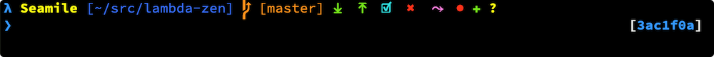
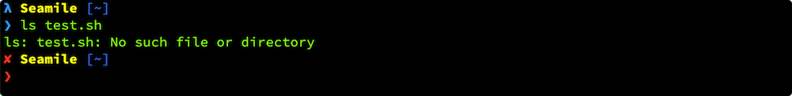
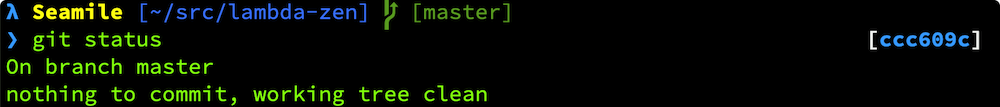
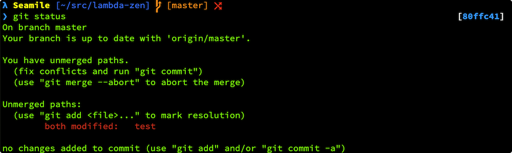
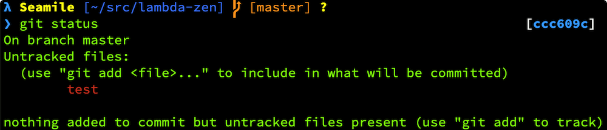

# Lambda Zen Theme

This is an [oh-my-zsh](https://ohmyz.sh/) theme. And inspired by [lambda mod theme](https://github.com/halfo/lambda-mod-zsh-theme).

This theme improves the display of multiple Git statuses.

## Summary

## Preview

#### Shell error status

#### Clean

#### Added

#### Ahead

#### Behind

#### Deleted

#### Modified

#### Renamed

#### Stashed

#### Unmerged

#### Untracked

